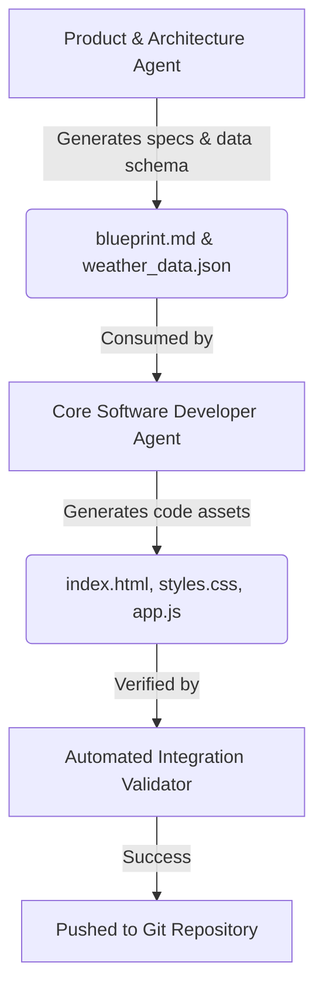

# Weather Dashboard App (Local Sandbox & YOLO AI Programming)

This repository contains a simple, local Weather Dashboard App created fully autonomously by an AI coding agent system under **YOLO (You Only Look Once) AI Programming** mode and executed inside a secure local sandbox environment.

## 🌤️ About the App
The Weather Dashboard is a premium web interface developed with **HTML**, **Tailwind CSS**, and **vanilla JavaScript**.
*   **Visual Aesthetics**: Uses glassmorphic design cards, dynamic gradients corresponding to current weather states, light/dark themes, and responsive layouts.
*   **Core Engine & Caching**: Formats dates dynamically based on timezone offsets, persists active settings (favorites, units, and themes) in `localStorage`, and includes a fallback database configuration to bypass browser CORS policies when opening via `file://`.
*   **Gauges & Timelines**: Incorporates complex SVG rendering to chart the daylight solar arc (using trigonometric formulas), updates a wind compass needle, and plots 15-hour forecasts utilizing Chart.js.

---

## 🛡️ Sandbox Environment
The development was executed in a **standard local sandbox** that enforces terminal restrictions and limits access to protect the host system:
*   **Filesystem Isolation**: Restricted read/write access to the local workspace directory, preventing unauthorized modifications outside of the project scope.
*   **Process Sandboxing**: Standard security controls that block arbitrary external executions and network access outside of explicitly whitelisted connections (e.g. standard CDN fetches for CSS frameworks and icon packages).
*   **Global Config**: Workspace settings configured in `.agents/settings.json` with `"enableTerminalSandbox": true` and YOLO-whitelisted globally via `trustedWorkspaces`.

---

## 🤖 Multi-Agent System & Coordination Pipeline
The project was built autonomously using a multi-agent system consisting of two specialized subagents coordinating over a strict pipeline:

1.  **Product & Architecture Agent (`product_architect`)**: 
    Developed a comprehensive architectural plan outlining the structural components (Search, Favorites Sidebar, Solar Arc Gauge, and Timeline Charts) and structured the mock global weather data (`weather_data.json`).
2.  **Core Software Developer Agent (`core_developer`)**:
    Consumed the blueprint to program the UI, assets, and state logic (`index.html`, `styles.css`, and `app.js`).
3.  **Automated Integration Validator**:
    A validation harness compiled, parsed, and confirmed syntactic correctness, asset linkages, and structure integrity prior to output deployment.
