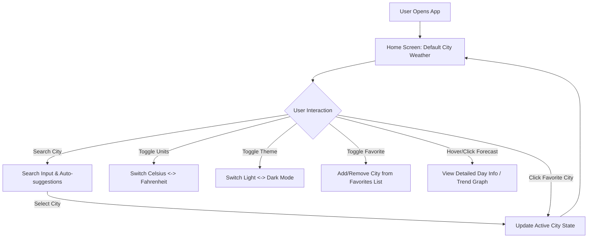
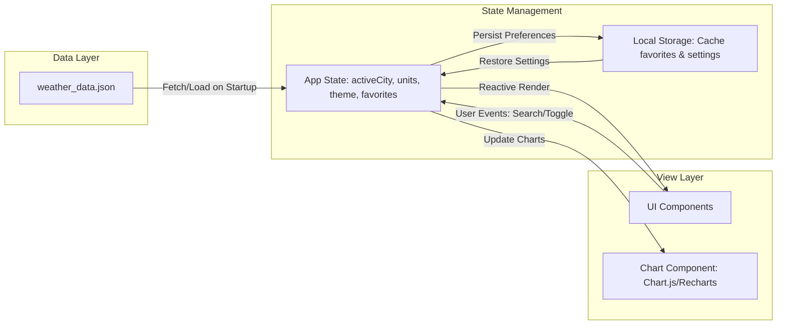

# Design Blueprint & Technical Specification: Weather Dashboard App

This document outlines the product requirements, user experience (UX) flow, technical architecture, component breakdown, and mock data loading mechanism for the **Weather Dashboard App**.

---

## 1. Product Overview & Objectives

The Weather Dashboard App is a modern, responsive single-page web application (SPA) designed to provide users with comprehensive, real-time-like weather information. Using a local mock dataset, it simulates live API integrations to deliver an instantaneous, rich, and highly interactive user experience.

### Key Objectives:
- **Comprehensive Weather Monitoring:** Display current weather metrics, hourly predictions, 7-day forecasts, and air quality indexes.
- **Dynamic Search & Discovery:** Enable users to find weather conditions of global cities instantly with auto-suggestions.
- **Personalized Dashboard:** Allow pinning cities as "favorites" for quick reference.
- **Customizable Preferences:** Support seamless switching between Celsius/Fahrenheit and Light/Dark themes.
- **Robust Performance:** Achieve near-zero latency by using a structured local JSON database (`weather_data.json`).

---

## 2. User Experience (UX) Flow & Wireframe Structure

### Screen Layout Hierarchy:
1. **Header / Navigation Bar:**
   - App Logo & Title.
   - Global Search input field with dropdown suggestions.
   - Theme Toggle (Sunny/Moon icon).
   - Temperature Unit Switcher (°C / °F).
2. **Main Layout Grid (Three Columns on Desktop, Stacked on Mobile):**
   - **Left Column:** Favorites Sidebar, featuring cards showing the name, current temp, and conditions of pinned cities.
   - **Center Column (Main Content):**
     - **Primary Weather Hero Card:** City Name, Date/Time, Temperature, Condition text + icon, High/Low, and "Feels Like".
     - **Hourly Forecast Chart:** Visual representation (line/bar charts) of temperatures and precipitation probability over the next 15 hours.
     - **Detailed Weather Metrics Grid:** 6-card grid displaying UV Index, Wind Speed/Direction, Air Quality (AQI), Sunrise/Sunset times, Humidity, and Visibility.
   - **Right Column:**
     - **7-Day Forecast List:** Clean rows highlighting the weekday name, weather icon, probability of rain (%), and min/max temperatures.

---

## 3. Technical Architecture & Data Flow

The application is built as a single-page application using modern web technologies. Below is the data flow and system architecture:

### Core Technologies:
- **UI Framework/Library:** HTML5, CSS3 (Tailwind CSS for responsive layouts), and modern ES6+ JavaScript (React/Vue/Svelte or Vanilla JS/Web Components).
- **Visualization:** Chart.js, Recharts, or ApexCharts for rendering weather trend timelines.
- **Styling & Assets:** SVG icons (OpenWeatherMap compatible icons) for crisp scale-independent representations.

---

## 4. Mock Weather Data Structure (`weather_data.json`)

The application consumes [weather_data.json](file:///home/peea/Documents/Sandbox%20+%20Yolo%20test/weather_data.json) as its data source. The schema is defined below:

### JSON Schema Breakdown:
- **`cities`**: An array of city objects.
  - **`id`**: Unique kebab-case identifier (e.g., `"new-york"`).
  - **`name`**: Display name of the city.
  - **`country`**: Two-letter ISO country code.
  - **`lat` / `lon`**: Coordinates for future mapping integrations.
  - **`timezone`**: Timezone string for proper local time displays.
  - **`current`**: Current weather condition parameters:
    - `temp`, `feels_like`, `temp_min`, `temp_max`: Temperatures in Celsius.
    - `pressure` (hPa), `humidity` (%), `wind_speed` (m/s), `wind_deg` (degrees).
    - `weather_state` (e.g., Rain, Clouds) & `weather_description` (e.g., "light intensity drizzle").
    - `icon`: 3-character icon ID.
    - `sunrise` / `sunset`: UNIX timestamps.
    - `uv_index`: UV intensity.
    - `visibility`: Visibility in meters.
    - `aqi`: Air Quality Index (1 = Good, 5 = Hazardous).
  - **`air_quality`**: Detailed AQI particulates (`pm25`, `pm10`, `co`, `no2`, `o3`, `so2`).
  - **`hourly`**: List of 15 hourly data points containing `time` (HH:MM), `temp`, `weather_state`, `icon`, and `pop` (Probability of Precipitation: 0.0 to 1.0).
  - **`daily`**: List of 7 daily forecast objects detailing temperatures, UV indices, humidity levels, and pop for the week ahead.

---

## 5. UI Component Specifications

### 5.1 `SearchBar` Component
- **Behavior:**
  - Performs case-insensitive matching on input text against city names and countries from `weather_data.json`.
  - Displays a dropdown of matching locations when input is active.
  - Keyboard navigation (Up/Down arrow keys + Enter to select).
  - Clears input and blurs on selection.

### 5.2 `WeatherHero` Component
- **Behavior:**
  - Renders the primary current conditions.
  - Automatically calculates Celsius/Fahrenheit based on app configuration:
    $$T_{°F} = (T_{°C} \times \frac{9}{5}) + 32$$
  - Displays dynamic relative time indicators using timezone calculations.

### 5.3 `HourlyTrendChart` Component
- **Behavior:**
  - Displays a dual-axis chart (Line chart for Temperature trend, Bar chart for Precipitation probability %).
  - Hovering points triggers a detailed tooltip displaying wind speed and specific descriptions.

### 5.4 `DetailMetricsGrid` Component
- **Cards Included:**
  1. **Wind Speed/Direction Card:** Interactive wind-vane graphic using `wind_deg` rotation.
  2. **AQI & Pollutants Card:** Progress bar showing AQI rating, details particulate concentrations (PM2.5, PM10).
  3. **Sunrise/Sunset Card:** Visual solar arc showcasing progress through the daytime cycle.
  4. **Humidity Card:** Radial gauge/progress representing percentage.
  5. **UV Index Card:** Level scale showing index category (Low, Moderate, High, Very High, Extreme).
  6. **Pressure/Visibility Card:** Multi-stat tracker.

---

## 6. Implementation Roadmap

### Phase 1: Skeleton & Environment Setup
- Create basic project directory layout.
- Install standard dev dependencies (e.g., Tailwind CSS, chart libraries).
- Implement local JSON fetch and validation utility.

### Phase 2: Core State & Utility Development
- Write unit conversion helper functions.
- Configure state management hook/store to track favorites and settings.
- Implement LocalStorage persistence layer for settings.

### Phase 3: Component Assembly & Styling
- Implement UI components (`SearchBar`, `FavoritesSidebar`, `WeatherHero`, `MetricsGrid`).
- Style for responsive layouts (Mobile-first viewport strategy).
- Integrate Chart.js/Recharts timeline visualization.

### Phase 4: Interactions, Polish & Validation
- Add smooth transition animations for weather detail updates.
- Write test scripts verifying correct mathematical unit conversions.
- Verify screen accessibility (ARIA labels, keyboard navigation).
